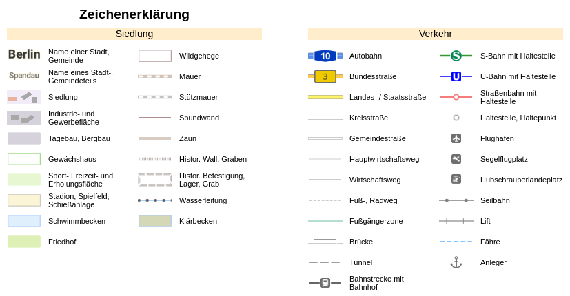

# Legends for vector tile styles

This web application creates legend images for vector tile styles, based on the [MapLibre style specification](https://maplibre.org/maplibre-gl-js-docs/style-spec/).



See full examples of legend images for a [color map](https://basemap.de/legende-web-raster-farbe/) and a [grayscale map](https://basemap.de/legende-web-raster-grau/), created with this web application for [basemap.de](https://basemap.de).

## Getting Started

To set up a local development environment you can follow these instructions.

### Prerequisites

You need a current version of [Node.js](https://nodejs.org) and npm package manager.

### Development

Clone this repository and navigate to the project folder. Then install the dependencies:

```sh
npm install
```

[Parcel](https://parceljs.org/) is used as build tool. Run the Parcel development server:

```sh
npm start
```

Now you can open the application in a browser: [http://localhost:1234](http://localhost:1234)

Build the application:

```sh
npm run build
```

Test the application:

```sh
npm run test
```

Linting JavaScript code (with or without fixing errors):

```sh
npm run lint
npm run lint:fix
```

### Docker

Navigate to the project folder, build a Docker image and start a container on port 80:

```sh
docker build -t vt-legend .
docker run --rm -p 80:80 vt-legend:latest
```

Build and start with Docker Compose:

```sh
docker-compose up --build
```

Now you can open the compiled version of the application in a browser: http://localhost

## Documentation

You can find more details about the customization of the legend in the [configuration documentation](docs/configuration.md).

## License
Licensed under the European Union Public License (EUPL). For more information see [LICENSE.txt](LICENSE.txt).

Copyright 2022-2024 Landesamt für Geoinformation und Landesvermessung Niedersachsen